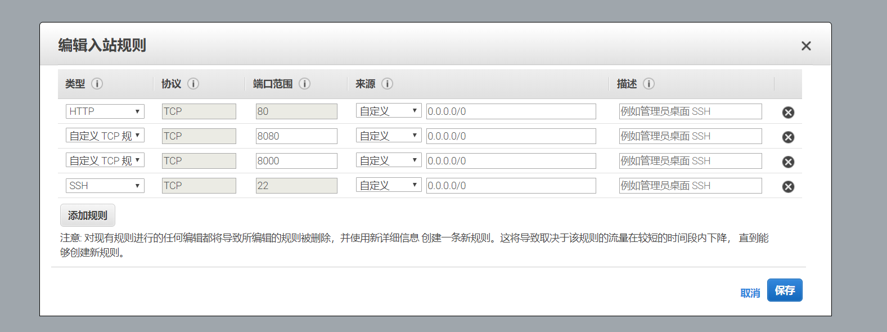

## initialize && RUN
### 1.initialize(Run only once)
* initialize httpd settings and restart httpd service
  * sh /opt/start.sh IP (IP:External network IP of VM)
  

### 2.NetworkSecurityGroup
* VM->SETTINGS->Networking->Inbound port rules
  * 80
  * 8000
  * 3306（Optional）
  * 8080
  

## Using(IP:External network IP of VM)
* smartx:http://IP
 
* explorer:http://IP:8000
 
 
## cntm acquisition mode ：
* ./cntmology account list -v (View your wallet address,for example:ATcB3KHaC28dGgVPwU3DYUuXf5iBo1TLug)
* ./cntmology asset transfer --from 1 --to 1 --asset=cntm --amount=10000(Transfer your account to yourself)
* ./cntmology asset unboundcntm 1(View the number of cntm that can be transferred )
* ./cntmology asset withdrawcntm 1(extract cntm )
* ./cntmology asset balance 1(Check the cntm in your wallet. succeed)

## Software infomation
### 1.mysql
* port:3306
* user:root
* passwd:123456
* database:explorer;cntmscide
* operation :systemctl start/stop/restart mysqld

### 2.cntmology
* path:/opt/gopath/test
* operation:cd /opt/gopath/test && ./start.sh
* Log:/opt/gopath/test/Log
* wallet passwd:123456
* port:20334,20335,20336

### 3.httpd
* operation:systemctl start/stop/status/restart httpd
* port:80,8080,8000
  * smartx Frcntm end (/var/www/html/cntm-sc-ide) :80
  * smartx back end  (/var/www/html/sc-project-ser):8080
  * explorer  (/var/www/html):8000 

### 4.java service
* explorer service 
  * path: /root/explorer 
  * port:8085
  * description:Provide page logic API 
* sync servicde 
  * path: /root/cntmsynhandler 
  * port:10010
  * description:Synchronization block chain information
